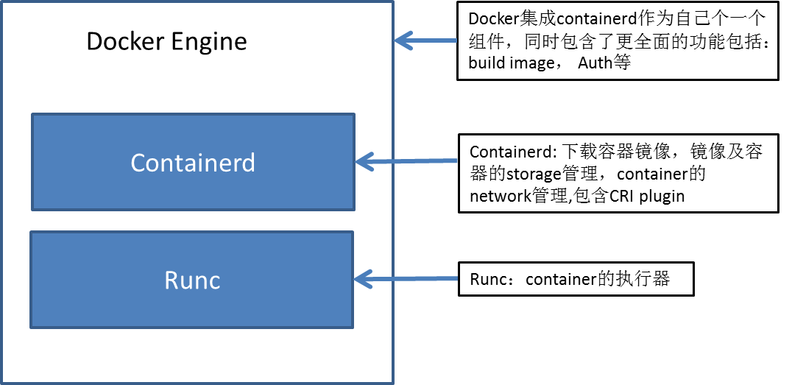

# Docker engine

Download URL: https://download.docker.com/linux/

The docker has several components integrated together to serve as an engine. 

#### Note: now docker engine don't support cgroup v2, so we can't disable cgroup v1.

## 1. Instllation
download the docker-ce package and install via dpkg command
```
dpkg -i <docker-ce deb package>
```

## 2. configure docker.service

Modify `ExecStart=` to `ExecStart=/usr/bin/dockerd`, since all configurations are moved to `/etc/docker/daemon.json`
and add `Slice=container.slice` in `[Service]` section.

example docker.service file can be found [here](./docker.srvice)
## 3. configure docker parameter via `/etc/docker/daemon.json`
```json
{
    "debug": true,
    "exec-opts": ["native.cgroupdriver=systemd"],
    "cgroup-parent": "container.slice",
    "hosts": ["tcp://0.0.0.0:2375","unix:///var/run/docker.sock"],
    "ip": "0.0.0.0",
    "log-driver": "journald",
    "log-opts":  {"tag":"docker_{{.Name}}_{{.ID}}"},
    "metrics-addr" : "0.0.0.0:9323",
    "experimental" : true,
    "insecure-registries" : [""]
}
```
3.1 storage driver 
For backend storage driver, default docker engine use aufs/overlay2, for enterprise usage, docker recommand use devicemapper with direct-lvm, if use fresh installation, we can directly set direct-lvm with following parameter:

3.1.1 auto-configure direct-lvm,managed automatically by docker engine daemon, just add following conf to `/etc/docker/daemon.json`

```json
  "storage-driver": "devicemapper",
  "storage-opts": [
    "dm.directlvm_device=/dev/sdb",
    "dm.thinp_percent=95",
    "dm.thinp_metapercent=1",
    "dm.thinp_autoextend_threshold=80",
    "dm.thinp_autoextend_percent=20",
    "dm.directlvm_device_force=false"
  ]
```
3.1.2 Manually direct-lvm
if we need to configure it manually, following steps are required
- Install proper requied dependencies
    - RHEL / CentOS: device-mapper-persistent-data, lvm2, and all dependencies
    - Ubuntu / Debian: thin-provisioning-tools, lvm2, and all dependencies

- Create pv 
    ```shell
    pvcreate /dev/sdb
    ```

- Create lvm group
    ```shell
    vgcreate docker /dev/sdb
    ```

- Create two logical volumes named `thinpool` and `thinpoolmeta`,The last parameter specifies the amount of free space to allow for automatic expanding of the data or metadata if space runs low, as a temporary stop-gap. These are the recommended values.
    ```shell
    lvcreate --wipesignatures y -n thinpool docker -l 95%VG
    lvcreate --wipesignatures y -n thinpoolmeta docker -l 1%VG
    ```

- Convert the volumes to thinpool and a storage location for metadata for the thinpool. using `lvconvert` command
    ```shell
    lvconvert -y --zero n -c 512K --thinpool docker/thinpool 
    --poolmetadata docker/thinpoolmeta
    ```

- Configure autoextension of thinpool via an `lvm` profile
    ```shell
    cat > /etc/lvm/profile/docker-thinpool.profile <<-EOF
    activation {
    thin_pool_autoextend_threshold=80
    thin_pool_autoextend_percent=20
    }
    EOF
    ```
- Apply the LVM profile 
    ```shell
    lvchange --metadataprofile docker-thinpool docker/thinpool
    ```
- Enable monitoring for logical volumes on your host. Without this step, automatic extension does not occur even in the presence of the LVM profile.
    ```shell
    lvs -o+seg_monitor
    ```

- add following configure to `/etc/docker/daemon.json`
    ```json
    {
        "storage-driver": "devicemapper",
        "storage-opts": [
        "dm.thinpooldev=/dev/mapper/docker-thinpool",
        "dm.use_deferred_removal=true",
        "dm.use_deferred_deletion=true"
        ]
    }    
    ```

- for complete guide to configure `lvm-direct`, refer to http://docs.docker.com/storage/storagedriver/device-mapper-driver

3.1.3 we can still use [zfs](https://docs.docker.com/storage/storagedriver/zfs-driver/) and [btrfs](https://docs.docker.com/storage/storagedriver/btrfs-driver/) as storage driver